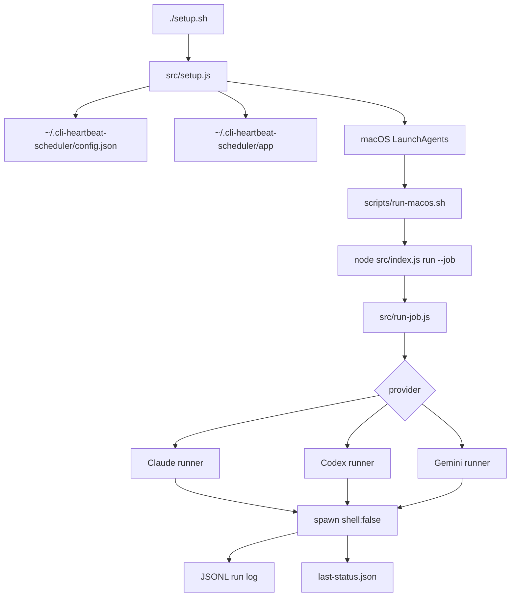

# CLI Heartbeat Scheduler 설계

## 목표

`cli-heartbeat-scheduler`는 Claude Code, Codex, Gemini CLI에 짧은 로컬 CLI 프롬프트를 정해진 시간에 실행하기 위한 작은 Node.js 프로젝트입니다.

핵심 목표는 다음과 같습니다.

- API key 기반 자동화가 아니라 컴퓨터에 로그인된 CLI 세션 사용
- 긴 agent 작업이 아니라 짧은 heartbeat 호출
- 대화 세션 resume이 아니라 매번 독립적인 CLI 호출
- 관리자 권한 없이 현재 사용자 계정에서 동작
- macOS와 Windows 모두 고려한 spawn 기반 provider runner
- macOS에서는 LaunchAgent로 스케줄 자동 등록

## 비목표

- 이전 Claude/Codex 대화를 이어가지 않습니다.
- 장시간 실행되는 agent workflow를 만들지 않습니다.
- Anthropic/OpenAI/Gemini API를 직접 호출하지 않습니다.
- provider API key를 저장하거나 관리하지 않습니다.
- 사용자 프로젝트를 수정하지 않습니다.
- Claude/Codex의 dangerous permission bypass 옵션을 기본값으로 사용하지 않습니다.

## 전체 구조



구성 요소:

- `setup.sh`: 사용자가 실행하는 설정 진입점
- `src/setup.js`: inquirer 기반 인터랙티브 설정 화면
- `src/setup-core.js`: config 생성, runtime copy, LaunchAgent 설치 흐름
- `src/platform/macos-launch-agent.js`: plist 생성, bootstrap, stale plist 정리
- `scripts/run-macos.sh`: launchd가 호출하는 wrapper
- `src/run-job.js`: 실제 provider CLI 실행과 로그 기록
- `src/providers/*`: provider별 command builder
- `src/status.js`: 설정, LaunchAgent, 최근 로그 조회
- `src/test-runner.js`: dry probe와 real smoke test

## 실행 모델

설정은 한 번에 여러 provider와 여러 시간을 profile로 받습니다.

예:

```json
{
  "scheduleProfile": {
    "agents": ["claude", "codex", "gemini"],
    "times": ["06:00", "11:00", "16:00"],
    "recurrence": {
      "type": "daily"
    },
    "prompt": "test! 출력"
  }
}
```

이 profile은 config load 시점에 job 목록으로 확장됩니다.

```text
claude-0600
claude-1100
claude-1600
codex-0600
codex-1100
codex-1600
gemini-0600
gemini-1100
gemini-1600
```

active config에는 `scheduleProfile`만 저장합니다. 이렇게 해야 `./setup.sh`를 다시 실행하거나 config를 다시 load할 때 generated job이 중복으로 쌓이지 않습니다.

## Config 위치

사용자 설정:

```text
~/.cli-heartbeat-scheduler/config.json
```

launchd 실행용 runtime copy:

```text
~/.cli-heartbeat-scheduler/app
```

runtime copy가 필요한 이유는 macOS launchd가 Desktop 하위 경로의 wrapper 실행을 막는 경우가 있었기 때문입니다. 실제 등록된 LaunchAgent는 Desktop checkout이 아니라 `~/.cli-heartbeat-scheduler/app` 아래의 script와 source를 바라봅니다.

## Provider command contract

### Claude Code

```text
claude -p --no-session-persistence --permission-mode dontAsk --tools "" --output-format text <prompt>
```

설계 의도:

- `-p`: prompt 실행 후 종료
- `--no-session-persistence`: 대화 세션 저장 방지
- `--permission-mode dontAsk`: 권한 질문으로 멈추지 않게 함
- `--tools ""`: heartbeat 호출에서 tool 사용 방지
- `--output-format text`: 짧은 stdout 유지

`--bare`는 기본값으로 사용하지 않습니다. 이 프로젝트는 local desktop-authenticated CLI 세션을 쓰는 것이 목적이므로, API key 중심 흐름으로 바뀔 수 있는 모드는 기본값에서 제외합니다.

### Codex

```text
codex --ask-for-approval never exec --ephemeral --skip-git-repo-check --sandbox read-only <prompt>
```

설계 의도:

- `exec`: 비대화형 실행
- `--ephemeral`: Codex session artifact 지속 방지
- `--skip-git-repo-check`: 전용 heartbeat workdir에서도 실행 가능
- `--sandbox read-only`: 파일 수정 방지
- `--ask-for-approval never`: 승인 대기로 멈추지 않고 실패 처리

Codex는 stdin이 열려 있으면 추가 입력을 기다릴 수 있습니다. 그래서 child process는 `stdio: ['ignore', 'pipe', 'pipe']`로 실행해 stdin을 명시적으로 닫습니다.

### Gemini CLI

```text
gemini -p <prompt> --approval-mode plan --output-format text
```

설계 의도:

- 짧은 prompt 실행 후 종료
- mutation/approval 흐름을 피하기 위한 plan mode
- text output 유지

## 권한과 안전 전략

기본 heartbeat는 최대한 단순하고 안전하게 실행됩니다.

- 별도 workdir 사용: `~/.cli-heartbeat-scheduler/workdir`
- Claude tools 비활성화
- Codex read-only sandbox 사용
- provider approval prompt가 뜨면 대기하지 않고 실패
- `shell: false`로 command injection 위험 축소
- timeout과 output byte limit 적용
- job별 lock으로 중복 실행 방지

## macOS LaunchAgent 모델

각 job마다 하나의 LaunchAgent plist를 생성합니다.

Label:

```text
com.local.cli-heartbeat-scheduler.<job-id>
```

Plist:

```text
~/Library/LaunchAgents/com.local.cli-heartbeat-scheduler.<job-id>.plist
```

ProgramArguments:

```text
~/.cli-heartbeat-scheduler/app/scripts/run-macos.sh
~/.cli-heartbeat-scheduler/app
~/.cli-heartbeat-scheduler/app/config.json
<job-id>
<label>
<plist-path>
<mode>
```

`mode`는 두 가지입니다.

- `once`: 실행 후 plist를 제거하고 bootout
- `persistent`: 실행 후 plist 유지

매일 실행은 `StartCalendarInterval`에 hour/minute만 넣습니다.

```xml
<dict>
  <key>Hour</key>
  <integer>6</integer>
  <key>Minute</key>
  <integer>0</integer>
</dict>
```

특정 요일 실행은 여러 개의 `StartCalendarInterval` dict를 배열로 만듭니다.

```xml
<array>
  <dict>
    <key>Weekday</key>
    <integer>1</integer>
    <key>Hour</key>
    <integer>6</integer>
    <key>Minute</key>
    <integer>0</integer>
  </dict>
</array>
```

macOS launchd weekday mapping은 테스트로 고정합니다.

```text
sun=0, mon=1, tue=2, wed=3, thu=4, fri=5, sat=6
```

## 설정 변경 모델

`./setup.sh`를 여러 번 실행할 수 있습니다.

흐름:

1. `~/.cli-heartbeat-scheduler/config.json`이 있으면 읽습니다.
2. 기존 agents, times, recurrence, weekdays, prompt를 기본값으로 보여줍니다.
3. 새 입력으로 config를 생성합니다.
4. runtime copy를 갱신합니다.
5. desired LaunchAgent label 목록을 계산합니다.
6. desired 목록에 없는 scheduler-owned plist를 제거합니다.
7. 새 plist를 쓰고 launchctl bootstrap으로 로드합니다.
8. dry probe 또는 real smoke test를 선택적으로 실행합니다.

이 흐름 때문에 기존 5시/9시 같은 고정 시간 스크립트 없이도 스케줄을 바꿀 수 있습니다.

## Locking

각 job은 state dir 아래 lock 파일을 사용합니다.

```text
~/.cli-heartbeat-scheduler/state/locks/<job-id>.lock
```

규칙:

- lock이 있고 process가 살아 있으면 새 실행은 `skipped_locked`
- process가 없으면 stale lock으로 보고 교체
- 정상 완료 또는 실패 후 lock 제거

## 로그와 상태

실행 로그:

```text
~/.cli-heartbeat-scheduler/logs/runs-YYYY-MM-DD.jsonl
```

마지막 상태:

```text
~/.cli-heartbeat-scheduler/state/last-status.json
```

launchd stdout/stderr:

```text
~/.cli-heartbeat-scheduler/logs/<job-id>.launchd.out.log
~/.cli-heartbeat-scheduler/logs/<job-id>.launchd.err.log
```

run result는 다음 상태를 가질 수 있습니다.

| 상태 | 의미 |
| --- | --- |
| `success` | CLI exit code `0` |
| `failed` | CLI non-zero exit |
| `timeout` | `timeoutMs` 초과 |
| `missing_cli` | CLI executable 없음 |
| `auth_required` | login/auth 필요로 보임 |
| `permission_blocked` | approval/permission 문제 |
| `skipped_locked` | 이전 실행이 아직 진행 중 |

## 테스트 전략

자동 테스트는 실제 provider 요청을 소비하지 않습니다. provider smoke test는 fake command를 사용합니다.

주요 테스트 범위:

- config validation
- `scheduleProfile` 확장
- KST `HH:MM` parser
- Claude/Codex/Gemini command builder
- child stdin close regression
- timeout handling
- log writing
- one-shot/daily/weekday plist generation
- stale LaunchAgent pruning
- runtime copy
- dry probe isolation
- status rendering
- setup config write and reload

검증 명령:

```bash
npm test
node src/index.js doctor --config examples/config.schedule-profile.example.json
node src/index.js list --config examples/config.schedule-profile.example.json --count 1
node src/index.js status --config examples/config.schedule-profile.example.json --launchctl false
node src/index.js test --mode dry --agents claude,codex
```

## Windows 설계 상태

provider runner는 `spawn()` 기반이며 Windows에서도 동작할 수 있도록 shell 의존을 줄였습니다. 다만 Phase 6 기준 자동 schedule registration은 macOS LaunchAgent가 중심입니다.

Windows Task Scheduler profile installer는 후속 phase로 남아 있습니다. 현재 repo에는 초기 검증용 PowerShell one-shot script가 legacy로 남아 있습니다.

## Legacy 산출물

초기 launchd 검증과 rollback을 위해 아래 파일은 legacy로 보존합니다.

```text
scripts/install-macos-once-5am.sh
scripts/uninstall-macos-once-5am.sh
scripts/install-macos-once-9am-test.sh
scripts/uninstall-macos-once-9am-test.sh
scripts/install-macos-once-910am-test.sh
scripts/uninstall-macos-once-910am-test.sh
scripts/install-windows-once-5am.ps1
scripts/run-once-macos.sh
config.5am-once.json
config.9am-test-once.json
config.910am-test-once.json
```

일반 사용자는 `./setup.sh`와 `node src/index.js uninstall`을 사용합니다.
